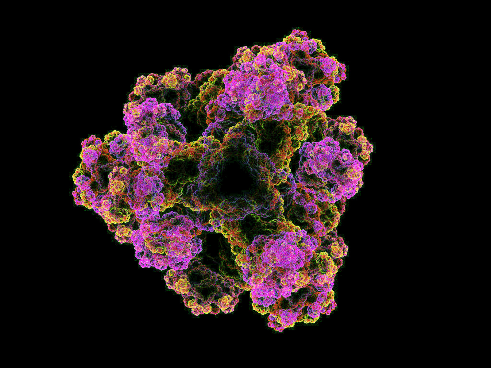
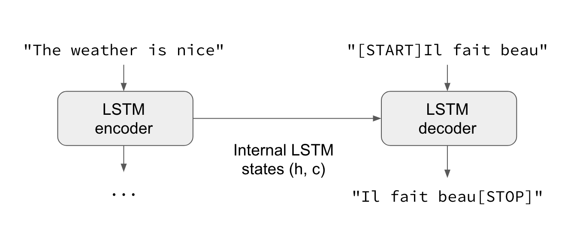
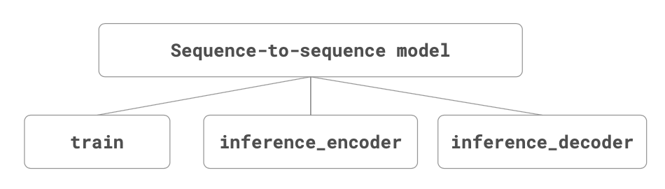
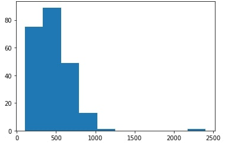
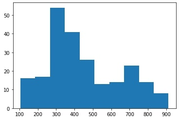

# TP-residues-classifier
Classifying residues of transmembrane proteins using a custom Seq2Seq model.

 

 

## 📗 Introduction

The implementation of a neural network for tackling structural bioinformatics problems is not a novel approach, but the implementation of a sequence-to-sequence model for the detection of transmembrane amino acids certainly is. Below we expand on how our neural network model was designed and constructed, and discuss further preprocessing that is particularly significant for the performance of our model.

## ✏️ Design

We approached the problem of classifying transmembrane residues as a sequence-to-sequence problem. An aminoacid sequence can be handed in as input, and the classification of each aminoacid as transmembrane or non-transmembrane would be outputted as a sequence of ones and zeroes, respectively. 

As such, no structural properties of the proteins were taken into account for model training or amino acid classification, and the proposed prediction algorithm consists a purely sequence-based approach. 

For the neural network approach, an encoder-decoder model was constructed. Encoder-decoder models are an alternative way of structuring Recurrent Neural Networks (RNNs) for sequence-to-sequence prediction problems.

The encoder-decoder models were originally developed for machine translation problems, although they have been successfully adapted for a vast majority of other Natural Language Processing (NLP) tasks.

The approach we followed involves two recurrent neural networks, one to encode the source sequence, called the encoder, and a second one to decode the encoded source sequence into the target sequence, called the decoder.

To be more precise, the seq-to-seq model proposed here consists of 3 submodels:

● The *train model* that can be trained given the source, target, and shifted target
sequences.
● The *inference_encoder* model used when making a prediction for a new source
sequence.
● The *inference_decoder* model used when making a prediction for a new source
sequence.

## 📈 Data Preprocessing and Model Assumptions

In the absence of ground-truth experimental results that can be used for the training and validation of our models, protein sequence and amino acid classification information were adapted from the OPM database. OPM is the leading state-of-the-art approach for the prediction of the transmembrane region of membrane proteins and incorporates an energy minimization scheme in order to achieve this.

Data from OPM was downloaded through the `assemblies/localizations` pages, for all the transmembrane proteins. Upon data review and inspection, we noted the following issues with the dataset at hand.

First and foremost, there were several instances of protein with multiple representations in PDB, for example the sucrose-specific porin (*Salmonella typhimurium*) has two PDB entries, 1A0S and 1A0T, which are both included in the OPM dataset. However, multiple representations of the same protein do not enrich the seq-to-seq model in any way, since this situation practically equates to multiple instances of the same amino acid sequence.

A similar behavior to what is explained above was also evident for plenty of protein representations that contained different chains of the same sequence. In that case, only one of the chains was retained as well. Therefore, since only one sequence is enough for our model, the dataset was preprocessed for sequence duplicate removals.

Another issue that was present in several protein representations was the classification of **all** amino acids as non-transmembrane. Of course, since the main focus of this project is to classify transmembrane amino acids, and taking into account that all the previously studied proteins are indeed validated as transmembrane, it did not make biological sense to keep erroneous classification of transmembrane aminoacids as non-transmembrane. Such instances were filtered out.

The last assumption made during the data preprocessing step -in the case of multiple instances of the same amino acid sequence- was retaining the instance with the maximum number of amino acids classified as transmembrane. For example, protein 1A0S contains three chains -P, Q, and R- with the same sequence, with different amino acid classifications for each of the three chains; chain P had 163 amino acids classified as transmembrane, chain Q had 167, and chain R had 164.

Without clashing with the biological context and in order to supply the model with more information regarding the characteristics of a transmembrane aminoacid -especially in the absence of a more general ground truth for the validation of our results- the sequence/instance with the maximum number of amino acids classified as transmembrane was chosen; in the example above, that is chain Q.

All the above provided us insight into what came to be a series of sequence selection criteria; to sum them up: In the case of sequence duplicates -either from multiple representations of the same protein, or from multiple same-sequence chains included in the same representation- only one sequence was retained. For that sequence, the instance with the maximum number of amino acids classified as transmembrane was chosen; the rest were filtered out. Sequences with all aminoacids classified as non-transmembrane were also filtered out.

Following sequence selection, 228 sequences were filtered in and included in the dataset on which our neural network was trained and tested. It should be noted here that for constructing, training, and testing a neural network, a total number of 228 instances are generally not considered enough. Nonetheless, we sought to test out our model and see how well it handled the data provided.

Upon dataset structuring, further preprocessing was carried out, which was mainly focused on not obstructing our neural network’s performance. Among the sequences that were chosen for the dataset, several were significantly longer than the rest as shown in the figure below (left panel), throwing the model out of balance.

To this end, outlier sequences with a length greater than 1000 amino acids were removed and the final distribution is shown in the plots above (right panel). Upon removal, we observed a significant performance improvement in our model. Most probably, this performance increase is immediately related to the last preprocessing steps, which are described below.

In order to transform the data into appropriate input for our sequence-to-sequence model, we performed encoding and zero-padding. During the former, the amino acid symbols/ letters were transformed into numbers -alphabetically, 1 on 1 matching with numbers 1:20.

During the latter, all the sequences were padded with zeros at the end of each sequence, until all sequences included the same number of amino acids. The common length of the encoded and padded amino acid sequences was set equal to the maximum number of the original sequences, which is equal to 923aa.

Following encoding and zero-padding, the input was reshaped to match the neural network input size, and split into train and test set. Two different scenarios were tested: a 90:10 train:test dataset split, and a test set selection which consisted of specific proteins of interest (discussed below).

Data preprocessing was carried out with a custom-made R script that utilized the data handling library dplyr for the majority of the filtering and selection steps.
